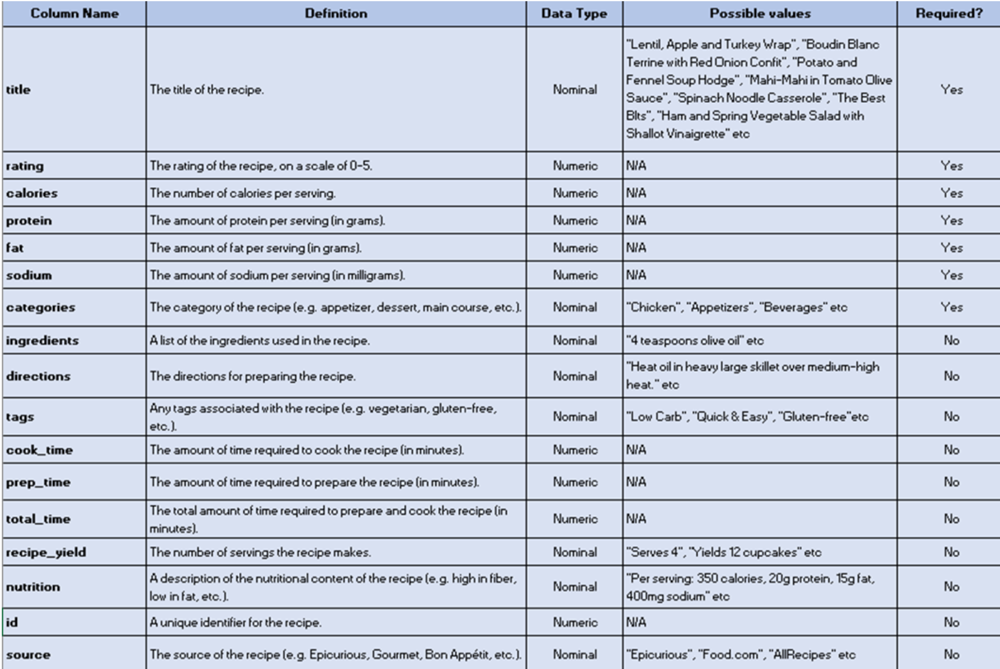
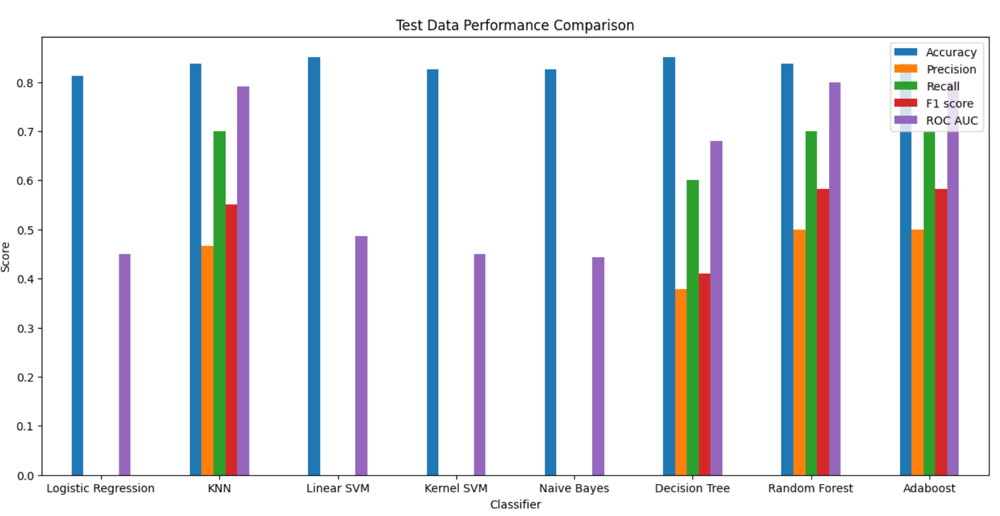

# 1. Dataset: Epicurious - Recipes with Rating and Nutrition

## 1.1 Data Description
The dataset from Kaggle, [**Epicurious - Recipes with Rating and Nutrition**](/https://www.kaggle.com/datasets/hugodarwood/epirecipes), contains 20,000 recipes from websites like Epicurious, Food.com, and Allrecipes. It includes detailed metadata for each recipe, such as:

* Recipe name
* Ingredients
* Cooking instructions
* User ratings
* Recipe category (e.g., dessert, main dish, appetizer)
* Cuisine type (e.g., Italian, Indian, French)
* Nutritional information (e.g., calories, fat, protein, etc.)

The dataset is provided in two files:

1. **full\_format\_recipes.json**: Contains complete recipe information.
2. **epi\_r.csv**: Contains recipe ratings.

The dataset can be used for various applications, including:

* **Recipe recommendation systems**
* **Nutritional analysis**
* **Cuisine popularity research**

For this analysis, the goal is to classify recipes that could be included in **Cake Week**.

***Table 1.1:** Data Dictionary of Recipe Dataset*

## 1.2 Exploratory Data Analysis
### 1.2.1 Data Visualization and Exploration

***Figure 1.1:** Box Plot*

***Figure 1.2:** Histogram*

***Figure 1.3:** Scatter Plot*

***Figure 1.4:** Pair Plot*

***Figure 1.5:** Correlation Heatmap*

### 1.2.2 Brainstorming and Discussions
Initially, I extracted recipe titles from a CSV file, using the #cakeweek tag indicated by a column value of 1. I found six titles marked with this tag and used them as reference data.

I then filtered the dataset for desserts by selecting titles where the "dessert" column had a value of 1. From this subset, I further refined the data by focusing on recipes marked as "cake = True," assuming these were more likely to be relevant for #cakeweek. To simplify the data structure, I created a new variable, "nutrition," to consolidate all nutrient-related values under one label.

To better understand the data, I visualized the features and their values:

* **Box plot**: Provided an overview of the feature distributions.
* **Histogram**: Showed that recipes with calorie values between **16 and 260** were most commonly associated with #cakeweek.
* **Scatter plot**: Displayed the distribution of recipes across calories and nutrition, with data points concentrated in a specific area.
* **Pair plots**: Allowed me to examine how the dataset was distributed across various variables.

To analyze the relationships among key variables, I created a **heat map** showing correlations between features like rating, nutrition, cake, calories, and other nutrients. The heat map revealed strong correlations, with values ranging from **0.7 to 0.92**.

From these insights, I identified a set of conditions that likely characterize recipes for #cakeweek:

1. Dessert = Yes

2. Cake = Yes

3. Sodium between 286 and 4,359

4. Protein between 8 and 87

5. Fat between 16 and 436

6. A ratio greater than 6 between selected measured quantities

## 1.3 Data Preprocessing

### 1.3.1 Handling Missing Values
I realized the data needed cleaning before applying machine learning algorithms. A missing value matrix showed the values were **not missing at random (NMAR)**—mostly affecting nutrient data, which likely influenced calorie counts. Since the dataset had no string values, no encoding was necessary.

***Figure 1.6:** Matrix showing missing values*

Deleting missing data wasn't an option due to its volume. I ruled out simple imputation (assumes randomness), time series imputation (not applicable), and iterative imputation (too slow and resource-heavy). Instead, I used **KNN imputation**, which preserved sample size, reduced bias, maintained variability, and captured non-linear relationships. It was the most efficient and effective method for this dataset.

***Figure 1.7:** Code for KNN Imputation*

### 1.3.2 Feature Scaling
The next step I took was scaling the data to ensure uniformity and improve model accuracy. I used **standard scaling** for the non-binary numerical features, as it adjusts values to have a mean of zero and a standard deviation of one. This was important because the features had different value ranges, which could bias certain algorithms. Standard scaling made the features more comparable while preserving their original distribution, unlike min-max scaling which can distort it.

***Figure 1.8:** Before Scaling*

***Figure 1.9:** After Scaling*

## 1.4 Development of Predictive Models
### 1.4.1 Dataset Splitting
To begin model building, I split the data using an 80:20 train-test ratio, which I found worked best after testing several options. I chose **"cake"** as the dependent variable and used the non-binary features as independent variables.

### 1.4.2 Model Selection and Parameter Settings
I tested multiple models for comparison, including **Logistic Regression, KNN, Linear SVM, Kernel SVM, Naive Bayes, Decision Tree, Random Forest**, and **AdaBoost**. I evaluated them using **Accuracy, Precision, Recall, F1 Score**, and **ROC AUC**, tuning parameters based on performance until I found the optimal values.

***Figure 1.10(a):** Code for the Parameters*

***Figure 1.10(b):** Code for the Parameters*

## 1.5 Models Evaluation
The results showed **Random Forest** and **AdaBoost** performed best, with **KNN** close behind. K-Fold cross-validation confirmed these findings. However, some models showed many null results, likely due to earlier preprocessing steps where I may have removed features with too many missing values or overlooked informative ones.

***Figure 1.11:** Test Data Performance Comparison*

***Figure 1.12:** K Fold Performance Comparison*

I noticed that the Confusion Matrix showed many True Positives but very few True Negatives, indicating a problem with data cleansing. I didn't adequately address the class imbalance during training, so the model may not have learned to distinguish the minority class well. To fix this, techniques like oversampling the minority class, undersampling the majority class, or using algorithms like SMOTE or ADASYN can help improve predictions.

Additionally, noise, errors, or inconsistencies in the data could be causing misclassifications and fewer true negatives. I need to focus on data cleaning, handling outliers, and addressing missing values to ensure more reliable predictions.

***Figure 1.13:** Confusion Matrix Performance Comparison*

## 1.6 Discussion
To improve the results, I could have:

1. **Used Neural Networks for Classification**: Neural networks, inspired by the brain's structure, consist of interconnected nodes (neurons) in layers. They are effective for classification tasks, helping to assign input data to specific categories or classes.

2. **Increased Data Size**: The amount of data used for training can significantly impact model performance. Increasing the training data size would have improved generalization, reduced bias, and enhanced model robustness. It also would have been beneficial for detecting rare classes in imbalanced datasets. Key benefits of larger data include:

   * **Improved Generalization**: Larger datasets help capture a wider range of patterns, reducing the risk of overfitting.
   * **Reduced Bias**: More data allows the model to learn more representative decision boundaries.
   * **Enhanced Robustness**: More data helps the model handle noise, outliers, and feature variations.
   * **Better Rare Class Detection**: More data for minority classes improves the model’s performance on imbalanced datasets.

3. **Used Pivot Table Relations for Better Data Management and Understanding**: Pivot tables help summarize, aggregate, and manipulate data based on different dimensions, enhancing both data management and understanding for classification tasks.

4. **Repeated Data Preprocessing and Cleaning**: Cleaning the data ensures accuracy and consistency by handling errors, missing values, and outliers. Re-performing this step would have improved the reliability and performance of the classification models.
